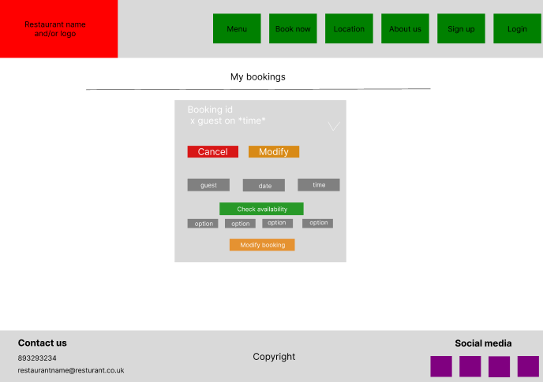

# Heaven pizza

[View Heaven Pizza live website here](https://heaven-pizza-d4d6b12eae4a.herokuapp.com/)

## Design

### Color Scheme

This are the main colors used for the website.

### Typography

The font used for this proyect are:

- *Righteous* for important titles
- *Cormorant Upright* for the navbar
- *Kameron* as base typography

### Database Scheme

Entity Relationship Diagram

- Booking store related to the booking such as date,user,number_of_guests, child_chair, allergies, booking_name and table_preferencies.
- Table store the tables of Heaven Pizza along with the capacity, it not intented to be mutable so if need any change, needs to be done manually from de admin panel.
- BookingTime its the table that connect the booking with the tables for x amount of time. If the booking needs more than one table to accomodate all the guests
it will create multiple instance with the same booking_id but diferents table_id (and with the same start and end time on all of them).

### Wireframes

This were wireframes before starting the proyect.

 Logged out

 Logged in

 Home

 Menu

 Booking

 My bookings

### User experience

- This site was made taking in mind the user experience, resulting of that it has an intuitive and easy to navegate navbar, descriptive messages when the user introduce an incorrect data and a response every time that the user expect one(modify, delete, create booking / login and logout).

## Features 

### Existing features

- Home page

    - Shows the title and an introduction to heaven pizza followed by the options to see the menu and book a table.

        

    - Alternatively if the user its not logged in he gonna see an option to sign up instead.

        

- Menu page

    - Here we have the menu items with the option to filter them by type.
    - When go to menu page Starter item filter is selected by default.

        

- Location page

    - Here we have a map with the location of the restaurant marked on it(the location it's ficticious).

        

- Sign up page

    - Here we have a form to sign up to heaven pizza with multiple password requirements.

        

    - Note that the username needs to be unique.

        

    - Theres also a link to sign in if already have an account.

        

- Sign in page 

    - Here we have a form to log in, aswell with a link to sign up if needed.

        

- Book now page

    - Here we have the form to book a table.
    - Booking name its requierd
    - Number of guest must be 1-10
    - Date and time its prefilled with the actual date and time.
    - Allergies, Table preferences and child chair are optionals.

        

    - If try to find a table on the past, you get a message saying that you can't.

        

    - When you try to find a table and there its not available you get 3 alternative options.

        

    - If something went wrong you get a message saying so. 

        

- My bookings page

    - Here you can see you bookings splited in active and past.
    - Note that the server time its on UTC +0 so the active and past may differ depending on your timezone.

        

    - The active bookings have the options to modify and cancel meanwhile the past one only have the option to cancel.

        

    - By pressing cancel you get a message poping up asking you if you are sure and if you confirm then you delete the booking.

        

    - By pressing on modify booking you get a form that works the same way that the one on Booking page.
    - The form its prefilled with the booking data.

        

    - When modifying a booking, the logic to check the availability ignore the actual booking when checking availability.

        

- Log out page

    - By pressing sign out you logout and get redirected to the home page

        

- Navbar 

    - Here we have a responsive menu that change to a dropdown for mobile.

        

    - If the user its not logged in he will see sign up and login.

        

    - If the user its logged in he will see book now, my bookings and logout,along with a hello **username** 

        

- Footer
    
    - Here we have the contact details and the social medias
    - All social medias opens a link on a new tab.

        

- Messages

    - When the user login, logout, signup or create, modify or delete a booking a closeable descriptive message will appear behind the navbar.

        

## Deployment and Local Developement

Live deployment can be found [here](https://github.com/PaaulCB/Heaven-pizza)

### Local Developement

#### How to Fork
1. Log in(or Sign Up) to Github
2. Go to repository for this project [here](https://github.com/PaaulCB/Heaven-pizza)
3. Click the fork button in the top right corner

#### How to Clone
1. Log in(or Sign Up) to Github
2. Go to repository for this project [here](https://github.com/PaaulCB/Heaven-pizza)
3. Click on the code button, select whether you would like to clone with HTTPS, SSH or GitHub CLI and copy the link shown.
4. Open the terminal in your code editor and change the current working directory to the location you want to use for the cloned directory.
5. Type the following command in the terminal (after the git clone you will need to paste the link you copied in step 3)
6. Set up a virtual environment (this step is not required if you are using the Code Institute Template in GitPod as this will already be set up for you).
7. Install the packages from the requirements.txt file - run Command pip3 install -r requirements.txt

### ElephantSQL Database
[Heaven Pizza](https://github.com/PaaulCB/Heaven-pizza) is using [ElephantSQL](https://www.elephantsql.com/) PostgreSQL Database

1. Click Create New Instance to start a new database.
2. Provide a name (this is commonly the name of the project: tribe).
3. Select the Tiny Turtle (Free) plan.
4. You can leave the Tags blank.
5. Select the Region and Data Center closest to you.
6. Once created, click on the new database name, where you can view the database URL and Password.

### Cloudinary
[Heaven Pizza](https://github.com/PaaulCB/Heaven-pizza) is using [Cloudinary](https://cloudinary.com/)
1. For Primary interest, you can choose Programmable Media for image and video API.
2. Optional: edit your assigned cloud name to something more memorable.
3. On your Cloudinary Dashboard, you can copy your API Environment Variable.
4. Be sure to remove the CLOUDINARY_URL= as part of the API value; this is the key.

### Heroku Deployment
* Log into [Heroku](https://www.heroku.com/) account or create an account.
* Click the "New" button at the top right corner and select "Create New App".
* Enter a unique application name
* Select your region
* Click "Create App"

#### Prepare enviroment and settings.py
* In your GitPod workspace, create an env.py file in the main directory.
* Add the DATABASE_URL value and your chosen SECRET_KEY value to the env.py file.
* Update the settings.py file to import the env.py file and add the SECRETKEY and DATABASE_URL file paths.
* Comment out the default database configuration.
* Save all files and make migrations.
* Add the Cloudinary URL to env.py
* Add the Cloudinary libraries to the list of installed apps.
* Add the STATIC files settings - the url, storage path, directory path, root path, media url and default file storage path.
* Link the file to the templates directory in Heroku.
* Change the templates directory to TEMPLATES_DIR
* Add Heroku to the ALLOWED_HOSTS list the format ['app_name.heroku.com', 'localhost']

#### Add the following Config Vars in Heroku:

* SECRET_KEY - This can be any Django random secret key
* CLOUDINARY_URL - Insert your own Cloudinary API key
* DATABASE_URL - Insert your own ElephantSQL database URL here

#### Heroku needs two additional files to deploy properly

* requirements.txt
* Procfile

#### Deploy

1. Make sure DEBUG = False in the settings.py
2. Go to the deploy tab on Heroku and connect to GitHub, then to the required repository.
3. Scroll to the bottom of the deploy page and either click Enable Automatic Deploys for automatic deploys or Deploy Branch to deploy manually. Manually deployed branches will need re-deploying each time the GitHub repository is updated.
4. Click 'Open App' to view the deployed live site.

## Testing

Please see  [TESTING.md](TESTING.md) for all the detailed testing performed.