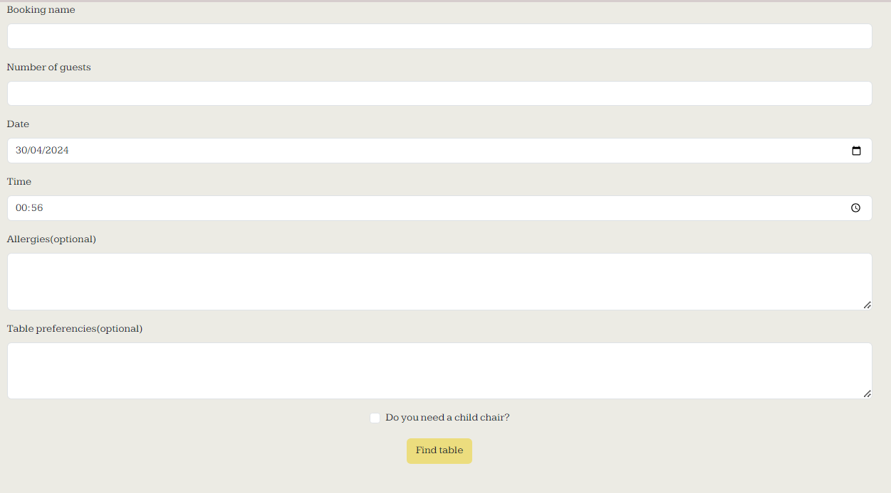
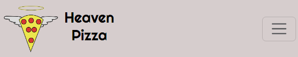

# Heaven pizza

[View Heaven Pizza live website here](https://heaven-pizza-d4d6b12eae4a.herokuapp.com/)

## Features 

### Existing features

- Home page

    - Shows the title and an introduction to heaven pizza followed by the options to see the menu and book a table.

        

    - Alternatively if the user its not logged in he gonna see an option to sign up instead.

        

- Menu page

    - Here we have the menu items with the option to filter them by type.
    - When go to menu page Starter item filter is selected by default.

        

- Location page

    - Here we have a map with the location of the restaurant marked on it(the location it's ficticious).

        

- Sign up page

    - Here we have a form to sign up to heaven pizza with multiple password requirements.

        

    - Note that the username needs to be unique.

        

    - Theres also a link to sign in if already have an account.

        

- Sign in page 

    - Here we have a form to log in, aswell with a link to sign up if needed.

        

- Book now page

    - Here we have the form to book a table.
    - Booking name its requierd
    - Number of guest must be 1-10
    - Date and time its prefilled with the actual date and time.
    - Allergies, Table preferences and child chair are optionals.

        

    - If try to find a table on the past, you get a message saying that you can't.

        

    - When you try to find a table and there its not available you get 3 alternative options.

        

    - If something went wrong you get a message saying so. 

        

- My bookings page

    - Here you can see you bookings splited in active and past.
    - Note that the server time its on UTC +0 so the active and past may differ depending on your timezone.

        

    - The active bookings have the options to modify and cancel meanwhile the past one only have the option to cancel.

        

    - By pressing cancel you get a message poping up asking you if you are sure and if you confirm then you delete the booking.

        

    - By pressing on modify booking you get a form that works the same way that the one on Booking page.
    - The form its prefilled with the booking data.

        

    - When modifying a booking, the logic to check the availability ignore the actual booking when checking availability.

        

- Log out page

    - By pressing sign out you logout and get redirected to the home page

        

- Navbar 

    - Here we have a responsive menu that change to a dropdown for mobile.

        

    - If the user its not logged in he will see sign up and login.

        

    - If the user its logged in he will see book now, my bookings and logout,along with a hello **username** 

        

- Footer
    
    - Here we have the contact details and the social medias
    - All social medias opens a link on a new tab.

        

- Messages

    - When the user login, logout, signup or create, modify or delete a booking a closeable descriptive message will appear behind the navbar.

        