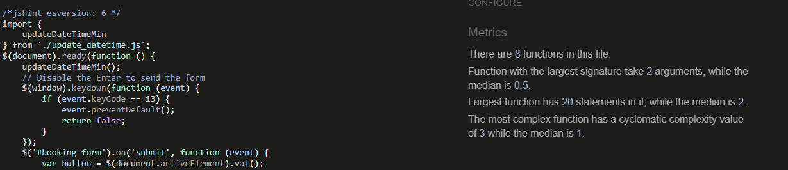
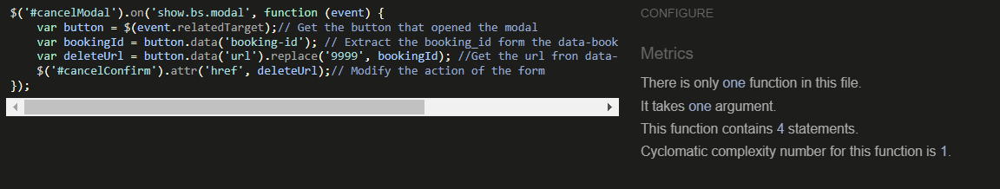
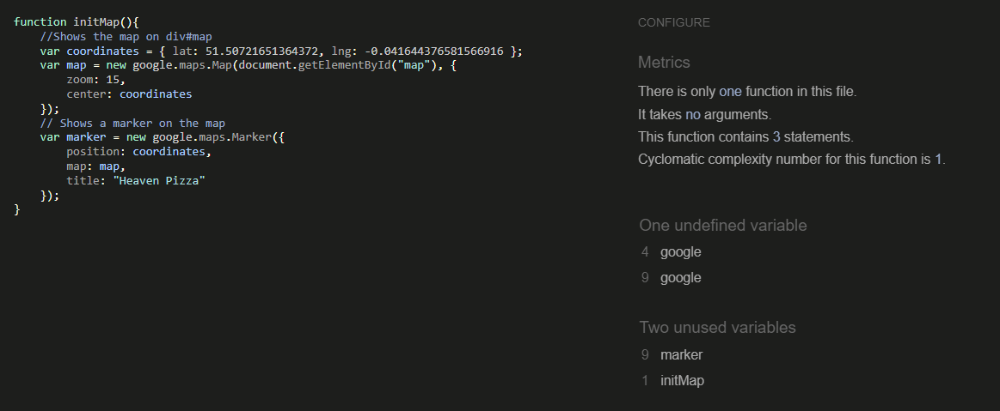
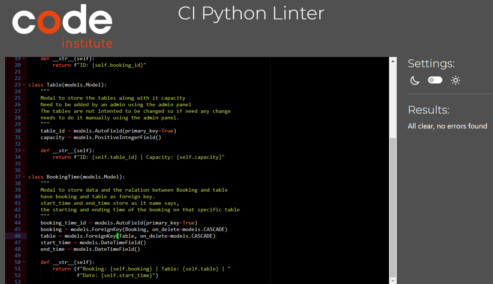

# Heaven Pizza | Testing

Return to [README](README.md)
- - -

## Responsiveness

 Desktop

 Laptop

 Tablet

 Mobile

## Code validation

### Html validation

 Home page

 Menu page

 Location page

 Login page

 Logout page

 Booking page

 My bookings page

 Signup page

There are 4 error related to missing span and p tag, but there are on the code. This form was taken from django.allauth templates.     

### CSS Validation

 Custom CSS (style.css)

### JavaScript Validation

 booking.js

 delete_booking.js

 modify_booking.js

 location.js

 update_datetime.js

 menu.js

### Python validator

#### Heaven pizza

 Urls

#### Core

 View

#### Location

 Urls

 Views

#### Menu

 Urls

 Views

 Models

#### Booking

 Urls

 Views

 Models

## Features testing

| Page          | User Action   | Expected Result  | Notes            |
|---------------|---------------|------------------|------------------|
| Home Page     |               |                  |                  |
|               | Click on Logo | Redirect to Home Page | PASS        |
|               | Click on Heaven Pizza | Redirect to Home Page | PASS        |
|               | Click on Home | Redirect to Home Page | PASS        |
|               | Click on Location | Redirect to Location Page | PASS        |
|               | Click on Sign up | Redirect to Sign up Page | PASS        |
|               | Click on Login | Redirect to Login Page | PASS        |
|               | Click on Menu | Redirect to Menu Page | PASS        |
|               | Click on Check our menu | Redirect to Menu Page | PASS        |
|               | Click on Sign up to book a table! | Redirect to Booking Page | PASS        |
| Home Page (Logged In - User)  |                 |          |  |
|               | After Login | Sign Up and Login options replaced are no longer available 
|               | After Login | Book now, My bookings and Logout options are availables 
|               | After Login | Hello *username* shown on navbar| PASS |
|               | Click on Logout | Redirect to Logout Page| PASS |
|               | Click on My Bookings | Redirects to my bookings Page | PASS |
|               | Click on Book now | Redirects to booking Page | PASS |
|               | After Login | A closeable message appears under the navbar indicating that user logged in | PASS |
| Menu Page     |               |                  |                  |
|               | On load | Shows starter items | PASS |
|               | Click on Drinks | Shows drink items | PASS |
|               | Click on Starter | Shows starter items | PASS |
|               | Click on Entree | Shows entree items | PASS |
|               | Click on Dessert | Shows dessert items | PASS |
|               | Click on drinks | Shows starter items | PASS |
| Location Page  |                  |                  |                  |
|               | On load | Shows the google maps with a marker on it on the (ficticious) location of the restaurant| PASS |
| Booking Page  |                  |                  |                  |
|               | On load | Date and time prefill with the present date and time | PASS |
|               | Find table with empty allergies | No error | PASS |
|               | Find table with empty table preferences | No error | PASS |
|               | Find table with empty Booking name | Request booking name | PASS |
|               | Find table with empty number of guests or over 10 | Request a valid number of guest | PASS |
|               | Find table with date and time before actual date | Show message asking for a valid date and time | PASS |
|               | Find table with correct data | If tables available at that time, show message saying table available and book now button  | PASS |
|               | Find table with correct data | If tables not available at that time, show message saying that there are not tables avaialable at that time and show 3 botons to book at the next 3 availables times | PASS |
|               | Change number of guest, date or time once the book option or alternative is shown | Remove the option to book a table having to find the table again| PASS |
|               | Book table | Reload the page and show a message saying that the booking has been made | PASS |
| My Bookings Page  |                  |                  |                  |
|               | On load | Show user booking gruped by active and past | PASS |
|               | On load | If user dont have any booking shows a message saying that he doesnt have any booking and a link to the booking page | PASS |
|               | Click on any active booking | Show modify and cancel booking buttons| PASS |
|               | Click on any past booking | Show cancel booking button| PASS |
|               | Click on cancel booking | Show cancel booking modal| PASS |
|               | Click confirm on booking modal | reload the page and show a message saying that the booking has been deleted| PASS |
|               | Click close or x on booking modal or outside the modal| close the cancel booking modal | PASS |
|               | Click on modify booking | Show cancel modify modal| PASS |
|               | Click on modify booking | Prefill form with booking data| PASS |
|               | Any test on modify model form| same results as tests on form on booking page| PASS |
|               | Book table | reload the page and show a message saying that the booking has been modified | PASS |
|               | Click x on booking modal or outside the modal| close the cancel modify modal and delete content on div#booking-results| PASS |
| Logout page  |                  |                  |                  |
|               | Click on sign out | Sign out user, redirect to home page and show a message saying that you have signed out| PASS |
| Sign up page  |                  |                  |                  |
|               | Click on sign in| Redirect to sign in page| PASS |
|               | Username that its already in use| Show a message taht the username its already taken| PASS |
|               | Incorrect email format| Requiere a valid email format| PASS |
|               | Empty email| No error, email its optional| PASS |
|               | Password invalid format| Shows descriptive message about whats wrong with the password| PASS |
|               | Click on sign up with valid data| Redirect to home page and show massage saying that has been signed in | PASS |
| Sign in page  |                  |                  |                  |
|               | Click on sign up| Redirect to sign up page| PASS |
|               | Incorrect user/password| Show that user/password its not correct| PASS |
|               | Click on sign up with valid data| Redirect to home page and show massage saying that has been signed in | PASS |
| Admin Panel |  |    |    |
|               | CRUD functionality | Working as expected | PASS |
| Footer(any page) |  |    |    |
|               | Click on social links | Open new tab with appropriate link | PASS |

## Bugs

### Fixed Bugs

- When first deployed my map on location page it didn't appear, somehow the staticfiles didn't load properly, i run python3 manage.py collectstatic and deployed again and the problem was solved. Commit **c9da11a**

- There was a bug where the user after checking the availability and get the button to book he could change the data from the form to book at any time. I fix it by deleting the button to book if the user changes any field relevant to the booking availability. Commit **b39d776**

- I had a bug where booking with an alternative time give error. The problem was that my logic didn't matched with my elements name, i fixed by changing the elements name where necessary. Commit **652167b**

- I had a bug where if the user tried to modify a booking, pressed find table, get any result, close that booking and open another one,he had the results of the previous booking on the new one. I fixed by deleting the results when the booking form its closed. Commit **325208e**

- I had an unexpected interaction with the min value of the date and time field form. When the page its load i set the min values to the actual time, unfortunatly as they are independient field it didn't work as intented. I fix it by removing the min value and checking if the date and time gived by the user was greater than the actual date with jQuery. Commit **57ab7e9** 

### Unfixed bugs

Return to [README](README.md)